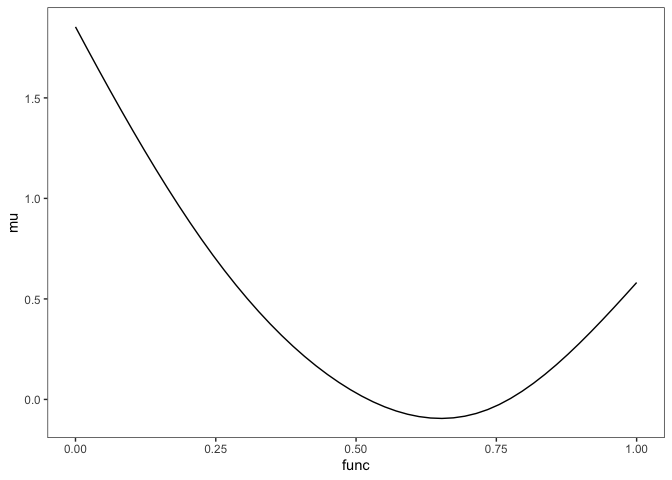
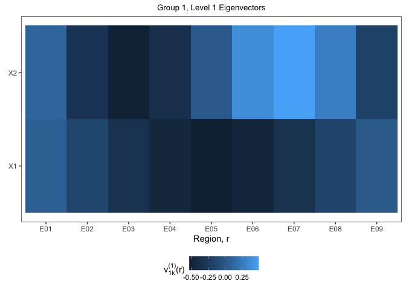
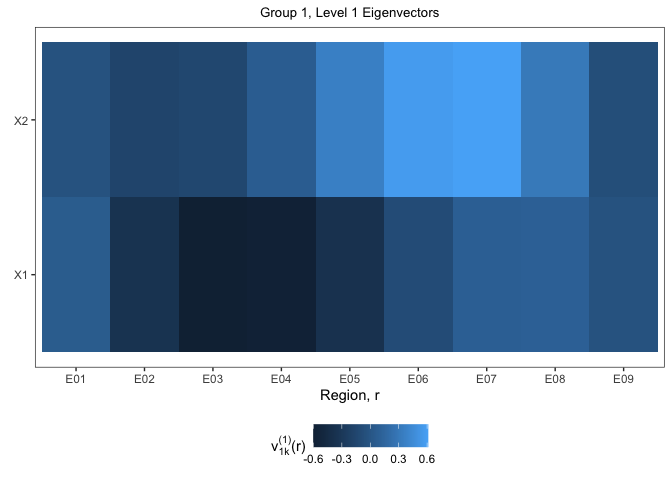
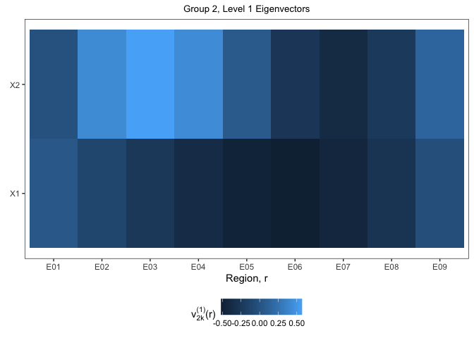
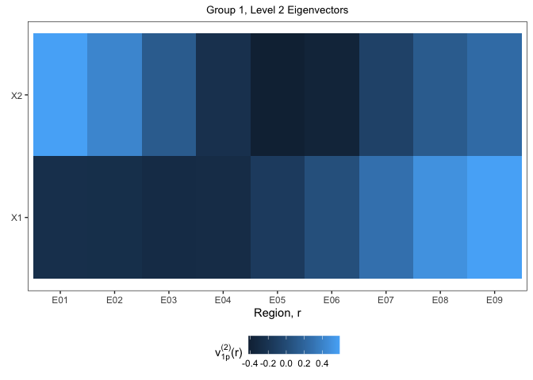
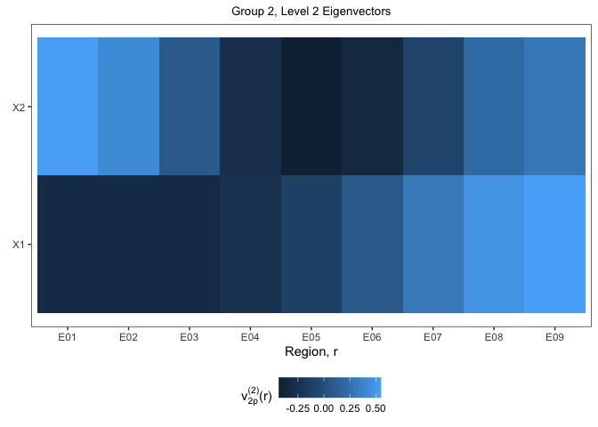
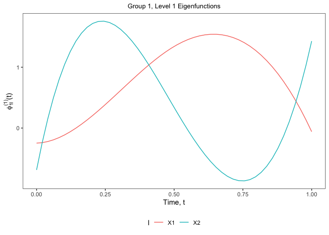
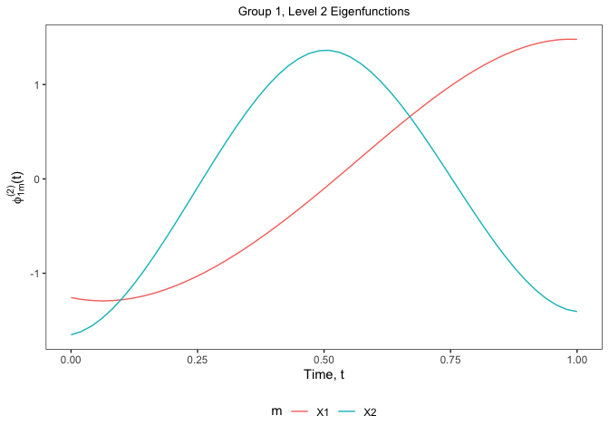
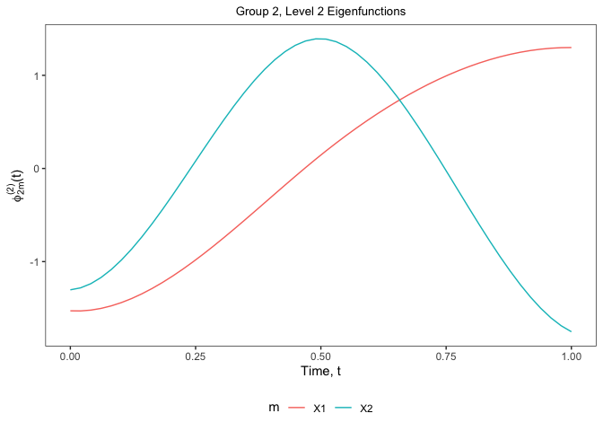

<!-- README.md is generated from README.Rmd. Please edit that file -->

# mhpca

<!-- badges: start -->
<!-- badges: end -->

The `mhpca` package is a tool for conducting Multilevel Hybrid Principal
Component Analysis (M-HPCA) proposed in Campos et al. (202?). This
package contains the functions necessary to estimate the marginal
eigenfunctions, eigenvectors, and product eigen components as well as
the tools for performing inference.

## Installation

You can install the development version from
[GitHub](https://github.com/) with:

``` r
# install.packages("devtools")
devtools::install_github("emjcampos/mhpca")
```

## Example

Begin by loading the `mhpca` package.

``` r
library(mhpca) 
```

Data can be simulated following the simulation low noise, dense set-up
from the supplementary materials using the following function:

``` r
sim = MHPCA_simulation(
  sig_eps       = 0.25,    # measurement error standard deviation 
  n_d           = 15,      # number of subjects per group
  J             = 2,       # number of repetitions per subject
  D             = 2,       # number of groups 
  num_reg       = 9,       # number of regions 
  num_time      = 50,      # number of functional time points 
  missing_level = FALSE,   # whether or not the data should be dense or sparse
  K = 2, # number of between-subject marginal regional eigenvectors 
  L = 2, # number of between-subject marginal functional eigenfunctions
  P = 2, # number of within-subject marginal regional eigenvectors 
  M = 2  # number of within-subject marginal functional eigenfunctions
)
```

The data must be in the following form, with columns labeled
`Repetition`, `Group`, `Subject`, `reg`, `func`, and `y`.

``` r
head(sim$data)
#>     Repetition   Group    Subject reg       func y_nonoise       noise        y
#> 1 Repetition 1 Group 1 Subject 01 E01 0.00000000  1.997063 -0.64808192 1.348981
#> 2 Repetition 1 Group 1 Subject 01 E01 0.02040816  1.871797  0.32850054 2.200298
#> 3 Repetition 1 Group 1 Subject 01 E01 0.04081633  1.751024 -0.15888575 1.592138
#> 4 Repetition 1 Group 1 Subject 01 E01 0.06122449  1.634616 -0.10749471 1.527121
#> 5 Repetition 1 Group 1 Subject 01 E01 0.08163265  1.522428 -0.04232958 1.480099
#> 6 Repetition 1 Group 1 Subject 01 E01 0.10204082  1.414302  0.15305454 1.567357
```

Using the `MHPCA_decomp` function, you can estimate the model
components.

``` r
MHPCA = MHPCA_decomp(
  data       = sim$data, # data frame in long format 
  fve_cutoff = 0.8,  # FVE cut-off for reducing the # of product eigen components 
  nknots     = 5,    # number of knots for smoothing splines
  maxiter    = 1000, # maximum iterations for MM algorithm
  epsilon    = 1e-3, # epsilon value for determining convergence
  reduce     = TRUE, # reduce the # of product eigen components and re-estimate model
  quiet      = FALSE # display messages for timing 
)
#> 0. Data formatting: 0.016 sec elapsed
#> 1. Estimation of Fixed Effects: 0.151 sec elapsed
#> 2. Estimation of Covariances
#>     a. Raw Covariances: 0.183 sec elapsed
#>     b,c. Estimation of Marginal Covariances and Smoothing: 0.667 sec elapsed
#> 3. Estimation of Marginal Eigencomponents: 0.004 sec elapsed
#> 4. Estimation of Variance Components
#>     a. Fit big model: 4.019 sec elapsed
#>     b. Choose number of components: 0.035 sec elapsed
#>     c. Final Model: 5.172 sec elapsed
#>     d. Prediction: 0.176 sec elapsed
#> MHPCA Decomposition and Estimation: 10.424 sec elapsed
```

All of the components can then be plotted and inspected.

``` r
ggplot(data.frame(func = unique(sim$data$func), mu = MHPCA$mu)) + 
  geom_line(aes(x = func, y = mu))
```



``` r
ggplot(MHPCA$eta) + 
  geom_line(aes(
    x = func, y = eta, 
    color = Group, 
    linetype = Repetition, 
    group = interaction(Group, Repetition, reg)
  ))
```



``` r
data.frame(MHPCA$marg$between$regional$`Group 1`$eigendecomp$vectors[, 1:2]) %>%
  mutate(reg = unique(sim$data$reg)) %>% 
  pivot_longer(X1:X2, names_to = "v") %>% 
  ggplot() + 
  geom_tile(aes(x = reg, fill = value, y = v)) + 
  labs(
    x = "Region, r", 
    y = element_blank(), 
    fill = TeX("$v^{(1)}_{1k}(r)$"), 
    title = "Group 1, Level 1 Eigenvectors"
  )

data.frame(MHPCA$marg$between$regional$`Group 2`$eigendecomp$vectors[, 1:2]) %>%
  mutate(reg = unique(sim$data$reg)) %>% 
  pivot_longer(X1:X2, names_to = "v") %>% 
  ggplot() + 
  geom_tile(aes(x = reg, fill = value, y = v)) + 
  labs(
    x = "Region, r", 
    y = element_blank(), 
    fill = TeX("$v^{(1)}_{2k}(r)$"), 
    title = "Group 2, Level 1 Eigenvectors"
  )
```



``` r
data.frame(MHPCA$marg$within$regional$`Group 1`$eigendecomp$vectors[, 1:2]) %>% 
  mutate(reg = unique(sim$data$reg)) %>% 
  pivot_longer(X1:X2, names_to = "v") %>% 
  ggplot() + 
  geom_tile(aes(x = reg, fill = value, y = v)) + 
  labs(
    x = "Region, r", 
    y = element_blank(), 
    fill = TeX("$v^{(2)}_{1p}(r)$"), 
    title = "Group 1, Level 2 Eigenvectors"
  )

data.frame(MHPCA$marg$within$regional$`Group 2`$eigendecomp$vectors[, 1:2]) %>% 
  mutate(reg = unique(sim$data$reg)) %>% 
  pivot_longer(X1:X2, names_to = "v") %>% 
  ggplot() + 
  geom_tile(aes(x = reg, fill = value, y = v)) + 
  labs(
    x = "Region, r", 
    y = element_blank(), 
    fill = TeX("$v^{(2)}_{2p}(r)$"), 
    title = "Group 2, Level 2 Eigenvectors"
  )
```



``` r
data.frame(MHPCA$marg$between$functional$`Group 1`$eigendecomp$vectors[, 1:2]) %>% 
  mutate(func = unique(sim$data$func)) %>% 
  pivot_longer(X1:X2, names_to = "phi") %>% 
  ggplot() + 
  geom_line(aes(x = func, y = value, color = phi)) + 
  labs(
    x = "Time, t", 
    y = TeX("$\\phi_{1l}^{(1)}(t)$"), 
    color = TeX("$l$"), 
    title = "Group 1, Level 1 Eigenfunctions"
  )

data.frame(MHPCA$marg$between$functional$`Group 2`$eigendecomp$vectors[, 1:2]) %>% 
  mutate(func = unique(sim$data$func)) %>% 
  pivot_longer(X1:X2, names_to = "phi") %>% 
  ggplot() + 
  geom_line(aes(x = func, y = value, color = phi)) + 
  labs(
    x = "Time, t", 
    y = TeX("$\\phi_{2l}^{(1)}(t)$"), 
    color = TeX("$l$"),
    title = "Group 2, Level 1 Eigenfunctions"
  )
```



``` r
data.frame(MHPCA$marg$within$functional$`Group 1`$eigendecomp$vectors[, 1:2]) %>% 
  mutate(func = unique(sim$data$func)) %>% 
  pivot_longer(X1:X2, names_to = "phi") %>% 
  ggplot() + 
  geom_line(aes(x = func, y = value, color = phi)) + 
  labs(
    x = "Time, t", 
    y = TeX("$\\phi_{1m}^{(2)}(t)$"), 
    color = TeX("$m$"),
    title = "Group 1, Level 2 Eigenfunctions"
  )

data.frame(MHPCA$marg$within$functional$`Group 2`$eigendecomp$vectors[, 1:2]) %>% 
  mutate(func = unique(sim$data$func)) %>% 
  pivot_longer(X1:X2, names_to = "phi") %>% 
  ggplot() + 
  geom_line(aes(x = func, y = value, color = phi)) +
  labs(
    x = "Time, t", 
    y = TeX("$\\phi_{2m}^{(2)}(t)$"), 
    color = TeX("$m$"),
    title = "Group 2, Level 2 Eigenfunctions"
  )
```



Using simulated data, we can calculate the errors of each model
component and display in a table, similar to the ones provided in the
paper:

``` r
groups = unique(data$Group) 
names(groups) = groups

parameter_order = c(
  "mu", "eta", "y", 
  "First Level 1 Eigenfunction", "Second Level 1 Eigenfunction", 
  "First Level 2 Eigenfunction", "Second Level 2 Eigenfunction", 
  "First Level 1 Eigenvector", "Second Level 1 Eigenvector", 
  "First Level 2 Eigenvector", "Second Level 2 Eigenvector",
  "Level 1", "Level 2", "sigma2", "rho"
) 

rbind(
  
  data.frame(
    func = unique(sim$data$func), 
    estimated = MHPCA$mu,
    true = sim$mu
  ) %>% 
    summarise(
      rse = pracma::trapz(func, (estimated - true) ^ 2) / 
        pracma::trapz(true ^ 2)
    ) %>% 
    mutate(parameter = "mu", .before = 1), 
  
  full_join(
    MHPCA$eta %>% 
      rename(estimated = eta), 
    map_dfr(sim$eta, function(d) { 
      map_dfr(d, function(j) {
        map_dfr(j, function(r) {
          data.frame(true = r) %>% 
            mutate(func = unique(sim$data$func), .before = 1)
        }, .id = "reg")
      }, .id = "Repetition")
    }, .id = "Group") %>% 
      mutate(
        Repetition = paste("Repetition", Repetition), 
        reg = paste0("E0", reg), 
        Group = paste("Group", Group)
      ), 
    .by = c("Group", "reg", "Repetition", "func")
  ) %>% 
    group_by(Group, Repetition, reg) %>% 
    summarise(
      rse_num = pracma::trapz(func, (estimated - true) ^ 2), 
      rse_den = pracma::trapz(true ^ 2), 
      .groups = "drop_last"
    ) %>% 
    summarise(
      rse = sum(rse_num) / sum(rse_den), 
      .groups = "drop"
    ) %>% 
    mutate(
      parameter = "eta", 
      .before = 1
    ) %>% 
    select(parameter, rse), 
  
  map_dfr(groups, function(d) {
    v_k <- map_dfc(sim$v_k, identity) %>% setNames(c("X1", "X2"))
    v_k_hat <- data.frame(
      MHPCA$marg$between$regional[[d]]$eigendecomp$vectors
    ) %>% 
      dplyr::select(1:ncol(v_k)) %>% 
      data.frame()
    
    map2_dfc(
      v_k, v_k_hat, 
      ~ if(sum((.y - .x)^2) > sum((-.y - .x)^2)) {
        -.y
      } else {
        .y
      }
    ) %>% 
      mutate(reg = unique(data$reg)) %>% 
      pivot_longer(X1:X2, names_to = "v", values_to = "estimated") %>% 
      left_join(
        v_k %>% 
          mutate(reg = unique(data$reg)) %>% 
          pivot_longer(X1:X2, names_to = "v", values_to = "truth"), 
        by = c("reg", "v")
      ) %>% 
      mutate(
        v = case_when(
          v == "X1" ~ "First Level 1 Eigenvector", 
          v == "X2" ~ "Second Level 1 Eigenvector"
        )
      )
  }, .id = "Group") %>% 
    group_by(Group, v) %>% 
    summarize(
      rse = sum((estimated - truth) ^ 2) / sum(truth ^ 2), 
      .groups = "drop"
    ) %>% 
    mutate(
      parameter = v, 
      .before = 1
    ) %>% 
    select(parameter, rse), 
  
  map_dfr(groups, function(d) {
    v_p <- map_dfc(sim$v_p, identity) %>% setNames(c("X1", "X2"))
    v_p_hat <- data.frame(
      MHPCA$marg$within$regional[[d]]$eigendecomp$vectors
    ) %>% 
      dplyr::select(1:ncol(v_p)) %>% 
      data.frame()
    
    map2_dfc(
      v_p, v_p_hat, 
      ~ if(sum((.y - .x)^2) > sum((-.y - .x)^2)) {
        -.y
      } else {
        .y
      }
    ) %>% 
      mutate(reg = unique(data$reg)) %>% 
      pivot_longer(X1:X2, names_to = "v", values_to = "estimated") %>% 
      left_join(
        v_p %>% 
          mutate(reg = unique(data$reg)) %>% 
          pivot_longer(X1:X2, names_to = "v", values_to = "truth"), 
        by = c("reg", "v")
      ) %>% 
      mutate(
        v = case_when(
          v == "X1" ~ "First Level 2 Eigenvector", 
          v == "X2" ~ "Second Level 2 Eigenvector"
        )
      )
  }, .id = "Group") %>% 
    group_by(Group, v) %>% 
    summarize(
      rse = sum((estimated - truth) ^ 2) / sum(truth ^ 2),
      .groups = "drop"
    ) %>%  
    mutate(
      parameter = v, 
      .before = 1
    ) %>% 
    select(parameter, rse), 
  
  
  map_dfr(groups, function(d) {
    phi_l <- map_dfc(sim$phi_l, identity) %>% setNames(c("X1", "X2"))
    
    phi_l_hat <- data.frame(
      MHPCA$marg$between$functional[[d]]$eigendecomp$vectors
    ) %>% 
      dplyr::select(1:ncol(phi_l)) %>% 
      data.frame()
    
    phi_l_hat <- map2_dfc(
      phi_l, phi_l_hat, 
      ~ if(pracma::trapz(unique(data$func), (.y - .x)^2) >
           pracma::trapz(unique(data$func), (-.y - .x)^2)) {
        -.y
      } else {
        .y
      }
    ) %>% 
      mutate(func = unique(data$func))
    
    phi_l %>%
      cbind(func = unique(data$func)) %>%
      gather(phi, value, -func) %>% 
      right_join(
        phi_l_hat %>% gather(phi, value, -func), 
        by = c("func", "phi")
      ) %>% 
      rename(
        truth = value.x, 
        estimated = value.y
      ) %>% 
      mutate(
        phi = case_when(
          phi == "X1" ~ "First Level 1 Eigenfunction", 
          phi == "X2" ~ "Second Level 1 Eigenfunction"
        )
      )
  }, .id = "Group") %>% 
    group_by(Group, phi) %>% 
    summarize(
      rse = pracma::trapz(func, (estimated - truth) ^ 2) / 
        pracma::trapz(truth ^ 2), 
      .groups = "drop"
    ) %>% 
    mutate(
      parameter = phi, 
      .before = 1
    ) %>% 
    select(parameter, rse), 
  
  map_dfr(groups, function(d) {
    phi_m <- map_dfc(sim$phi_m, identity) %>% setNames(c("X1", "X2"))
    
    phi_m_hat <- data.frame(
      MHPCA$marg$within$functional[[d]]$eigendecomp$vectors
    ) %>%  
      dplyr::select(1:ncol(phi_m)) %>% 
      data.frame()
    
    phi_m_hat <- map2_dfc( 
      phi_m, phi_m_hat, 
      ~ if(pracma::trapz(unique(data$func), (.y - .x)^2) >
           pracma::trapz(unique(data$func), (-.y - .x)^2)) {
        -.y
      } else {
        .y
      }
    ) %>% 
      mutate(func = unique(data$func))
    
    phi_m %>%
      cbind(func = unique(data$func)) %>%
      gather(phi, value, -func) %>% 
      right_join(
        phi_m_hat %>% gather(phi, value, -func), 
        by = c("func", "phi")
      ) %>% 
      rename(
        truth = value.x, 
        estimated = value.y
      ) %>% 
      mutate(
        phi = case_when(
          phi == "X1" ~ "First Level 2 Eigenfunction", 
          phi == "X2" ~ "Second Level 2 Eigenfunction"
        )
      )
  }, .id = "Group") %>% 
    group_by(Group, phi) %>% 
    summarize(
      rse = pracma::trapz(func, (estimated - truth) ^ 2) / 
        pracma::trapz(truth ^ 2),
      .groups = "drop"
    ) %>% 
    mutate(
      parameter = phi, 
      .before = 1
    ) %>% 
    select(parameter, rse),
  
  map_dfr(groups, function(d) {
    MHPCA$data[[d]] %>%
      group_by(Repetition, Subject, reg) %>%
      summarise(
        RSE_num = pracma::trapz(unique(data$func), (predicted - y)^2),
        RSE_den = pracma::trapz(unique(data$func), y^2),
        .groups = "drop_last"
      ) %>%
      summarise(
        rse = sum(RSE_num) / sum(RSE_den),
        .groups = "drop"
      )
  }, .id = "Group") %>% 
    mutate(parameter = "y", .before = 1) %>% 
    select(parameter, rse), 
  
  rbind(
    map_dfr(groups, function(d) {
      data.frame(
        parameter = "Level 1",
        component = MHPCA$model$final[[d]]$level1_components, 
        estimated = Matrix::diag(MHPCA$model$final[[d]]$Lambda1)
      )
    }, .id = "Group"),
    map_dfr(groups, function(d) {
      data.frame(
        parameter = "Level 2",
        component = MHPCA$model$final[[d]]$level2_components,
        estimated = Matrix::diag(MHPCA$model$final[[d]]$Lambda2)
      )
    }, .id = "Group")
  ) %>% 
    left_join(
      rbind(
        simulated$lambda_kl %>% 
          rename(
            regional = k, 
            functional = l
          ) %>% 
          mutate(level = "between"), 
        simulated$lambda_pm %>% 
          rename(
            regional = p, 
            functional = m
          ) %>% 
          mutate(level = "within")
      ) %>% 
        rename(truth = lambda) %>% 
        mutate(component = paste(level, regional, functional, sep = "_")),
      by = "component") %>% 
    select(parameter, estimated, truth) %>% 
    group_by(parameter) %>% 
    summarize(
      rse = (estimated - truth) ^ 2 / truth ^ 2
    ), 
  
  map_dfr(groups, function(d) { 
    MHPCA$model$final[[d]]$sigma2
  }, .id = "Group") %>% 
    gather(Group, estimated) %>% 
    mutate(truth = 0.25 ^ 2) %>% 
    summarize(rse = (estimated - truth) ^ 2 / truth ^ 2) %>% 
    mutate(parameter = "sigma2"), 
  
  functional_ICC(MHPCA) %>% 
    mutate(
      truth = sum(sim$lambda_kl$lambda) / (sum(sim$lambda_kl$lambda) + sum(sim$lambda_pm$lambda))
    ) %>% 
    rename(estimated = rho_dW) %>% 
    summarize(rse = (estimated - truth) ^ 2 / truth ^ 2) %>% 
    mutate(parameter = "rho")
  
) %>% 
  group_by(parameter) %>% 
  summarise(
    n = n(), 
    RSE = paste0(
      format.pval(
        quantile(rse, .5, na.rm = TRUE), 
        eps = 0.001, digits = 1, nsmall = 3
      ), " (", 
      format.pval(
        quantile(rse, .1, na.rm = TRUE), 
        eps = 0.001, digits = 1, nsmall = 3
      ), ", ", 
      format.pval(
        quantile(rse, .9, na.rm = TRUE), 
        eps = 0.001, digits = 1, nsmall = 3
      ), ")"
    ), .groups = "drop"
  ) %>% 
  slice(match(parameter_order, parameter)) %>% 
  mutate(
    parameter = c(
      "$\\mu(t)$", "$\\eta_{dc}(r, t)$", "$Y_{dij}(r,t)$",
      "$\\phi_{d1}^{(1)}(t)$", "$\\phi^{(1)}_{d2}(t)$",
      "$\\phi^{(2)}_{d1}(t)$", "$\\phi^{(2)}_{d2}(t)$",
      "$\\nu_{d1}^{(1)}(r)$", "$\\nu_{d2}^{(1)}(r)$",
      "$\\nu_{d1}^{(2)}(r)$", "$\\nu_{d2}^{(2)}(r)$",
      "$\\lambda_{dg}$", "$\\lambda_{dh}$", "$\\sigma^2_d$",
      "$\\rho_{dW}$"
    ), 
    .before = 1
  )
#> # A tibble: 15 x 3
#>    parameter                   n RSE                    
#>    <chr>                   <int> <chr>                  
#>  1 "$\\mu(t)$"                 1 <0.001 (<0.001, <0.001)
#>  2 "$\\eta_{dc}(r, t)$"        4 <0.001 (<0.001, <0.001)
#>  3 "$Y_{dij}(r,t)$"           60 0.073 (0.041, 0.412)   
#>  4 "$\\phi_{d1}^{(1)}(t)$"     2 0.002 (<0.001, 0.003)  
#>  5 "$\\phi^{(1)}_{d2}(t)$"     2 0.003 (0.001, 0.005)   
#>  6 "$\\phi^{(2)}_{d1}(t)$"     2 <0.001 (<0.001, <0.001)
#>  7 "$\\phi^{(2)}_{d2}(t)$"     2 <0.001 (<0.001, <0.001)
#>  8 "$\\nu_{d1}^{(1)}(r)$"      2 0.288 (0.095, 0.482)   
#>  9 "$\\nu_{d2}^{(1)}(r)$"      2 0.304 (0.116, 0.492)   
#> 10 "$\\nu_{d1}^{(2)}(r)$"      2 0.108 (0.079, 0.136)   
#> 11 "$\\nu_{d2}^{(2)}(r)$"      2 0.108 (0.080, 0.137)   
#> 12 "$\\lambda_{dg}$"           5 0.069 (0.029, 0.349)   
#> 13 "$\\lambda_{dh}$"           4 0.015 (<0.001, 0.069)  
#> 14 "$\\sigma^2_d$"             2 0.401 (0.298, 0.503)   
#> 15 "$\\rho_{dW}$"              2 0.053 (0.016, 0.090)
```

### Performing Bootstrapped Tests

In order to draw group-level inference via parametric bootstrap, we can
test the null hypothesis
*H*<sub>0</sub> : *η*<sub>*d**j*</sub>(*r*, *t*) = *η*<sub>*d*</sub>(*r*, *t*)
with the following function

``` r
boot_out = MHPCA_bootstrap_within(
  MHPCA  = MHPCA, 
  B      = 200, # number of bootstrap samples 
  region = "E01", 
  group  = "Group 1", 
  nknots = 5, 
  quiet  = FALSE
)
```

and for tests between groups, we test the null hypothesis
*H*<sub>0</sub> : *η*<sub>*d*<sub>1</sub>*j*<sub>1</sub></sub>(*r*, *t*) − *η*<sub>*d*<sub>1</sub>*j*<sub>2</sub></sub> = *η*<sub>*d*<sub>2</sub>*j*<sub>1</sub></sub> − *η*<sub>*d*<sub>2</sub>*j*<sub>2</sub></sub>
with the following function

``` r
boot_out = MHPCA_bootstrap_between(
  MHPCA  = MHPCA, 
  B      = 200, # number of bootstrap samples 
  region = "E01", 
  group  = c("Group 1", "Group 2"), 
  nknots = 5, 
  quiet  = FALSE
)
```
