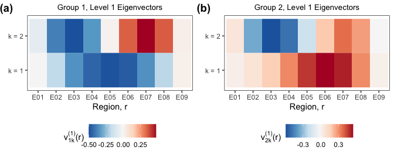
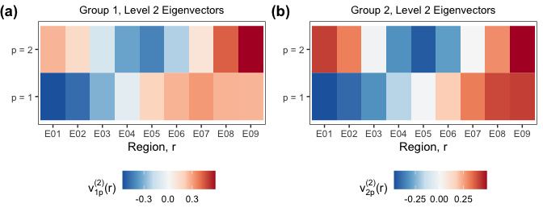

<!-- README.md is generated from README.Rmd. Please edit that file -->

# mhpca

<!-- badges: start -->
<!-- badges: end -->

The `mhpca` package is a tool for conducting Multilevel Hybrid Principal
Component Analysis (M-HPCA) proposed in Campos et al. (2021). This
package contains the functions necessary to estimate the marginal
eigenfunctions, eigenvectors, and product eigen components as well as
the tools for performing inference.

## Installation

You can install the development version from
[GitHub](https://github.com/) with:

``` r
# install.packages("devtools")
devtools::install_github("emjcampos/mhpca")
```

## Example

Begin by loading the `mhpca` package.

``` r
library(mhpca) 
```

Data can be simulated following the low noise, dense simulation set-up
with 15 subjects per group from the supplementary materials using the
following function:

``` r
sim = MHPCA_simulation(
  sig_eps       = 0.25,    # measurement error standard deviation 
  n_d           = 15,      # number of subjects per group
  J             = 2,       # number of repetitions per subject
  D             = 2,       # number of groups 
  num_reg       = 9,       # number of regions 
  num_time      = 50,      # number of functional time points 
  missing_level = FALSE,   # whether or not the data should be dense or sparse
  K = 2, # number of between-subject marginal regional eigenvectors 
  L = 2, # number of between-subject marginal functional eigenfunctions
  P = 2, # number of within-subject marginal regional eigenvectors 
  M = 2  # number of within-subject marginal functional eigenfunctions
)
```

The data must be in the following form, with columns labeled
`Repetition`, `Group`, `Subject`, `reg`, `func`, and `y`.

``` r
head(sim$data)
#>     Repetition   Group    Subject reg       func         y
#> 1 Repetition 1 Group 1 Subject 01 E01 0.00000000 1.1112244
#> 2 Repetition 1 Group 1 Subject 01 E01 0.02040816 1.4425836
#> 3 Repetition 1 Group 1 Subject 01 E01 0.04081633 0.7398267
#> 4 Repetition 1 Group 1 Subject 01 E01 0.06122449 1.4110934
#> 5 Repetition 1 Group 1 Subject 01 E01 0.08163265 1.0086881
#> 6 Repetition 1 Group 1 Subject 01 E01 0.10204082 0.8625667
```

Using the `MHPCA_decomp` function, you can estimate the model
components.

``` r
MHPCA = MHPCA_decomp(
  data       = sim$data, # data frame in long format 
  fve_cutoff = 0.8,  # FVE cut-off for reducing the # of product eigen components 
  nknots     = 5,    # number of knots for smoothing splines
  maxiter    = 1000, # maximum iterations for MM algorithm
  epsilon    = 1e-3, # epsilon value for determining convergence
  reduce     = TRUE, # reduce the # of product eigen components and re-estimate model
  quiet      = FALSE # display messages for timing 
)
#> 0. Data formatting: 0.016 sec elapsed
#> 1. Estimation of Fixed Effects: 0.16 sec elapsed
#> 2. Estimation of Covariances
#>     a. Raw Covariances: 0.191 sec elapsed
#>     b,c. Estimation of Marginal Covariances and Smoothing: 0.783 sec elapsed
#> 3. Estimation of Marginal Eigencomponents: 0.004 sec elapsed
#> 4. Estimation of Variance Components
#>     a. Fit big model: 4.423 sec elapsed
#>     b. Choose number of components: 0.039 sec elapsed
#>     c. Final Model: 5.471 sec elapsed
#>     d. Prediction: 0.196 sec elapsed
#> MHPCA Decomposition and Estimation: 11.284 sec elapsed
```

The output of the `MHPCA_decomp` function

| name  | description                                                                                                                                                                                                  |
|-------|--------------------------------------------------------------------------------------------------------------------------------------------------------------------------------------------------------------|
| mu    | overall mean function ( vector)                                                                                                              |
| eta   | group-region-reptition-specific shifts ( data frame with columns for `Group`, `reg`, `Repetition`, `func`, `eta`) |
| covar | list with the total, between- and within-subject covariances                                                                                                                                                 |
| marg  | list with the between- and within-subject marginal covariances, eigenvectors, and eigenfunctions                                                                                                             |
| model | list with the full and reduced models and their components (scores and variance components)                                                                                                                  |
| data  | data used in the mixed effects model                                                                                                                                                                         |
| FVE   | fraction of variance explained by each product eigen component, G’ and H’                                                                                                                                    |

### Plotting

All of the components can then be plotted and inspected.

#### Overall Mean Function

The estimated overall mean function
")
can be accessed using `MHPCA$mu`

``` r
ggplot(data.frame(func = unique(sim$data$func), mu = MHPCA$mu)) + 
  geom_line(aes(x = func, y = mu)) + 
  labs(
    x = TeX("$t$"), 
    y = TeX("$\\mu(t)$"), 
    linetype = element_blank()
  ) 
```


#### Group-Region-Repetition-Specific Shifts

The estimated group-region-repetition-specific shifts
")
can be accessed using `MHPCA$eta`

``` r
ggplot(MHPCA$eta) + 
  geom_line(aes(
    x = func, y = eta, 
    color = Group, 
    linetype = Repetition, 
    group = interaction(Group, Repetition, reg)
  )) + 
  labs(
    y = TeX("$\\eta_{dj}(r, t)$"), 
    x = TeX("$t$"), 
    linetype = element_blank(), 
    color = element_blank()
  )
```


#### Level 1 Marginal Eigenvectors

The level 1 marginal regional eigenvectors
}(r)")
for Group 1 are stored in
`MHPCA$marg$between$regional$'Group 1'$eigendecomp$vectors`.

``` r
cowplot::plot_grid(
  data.frame(MHPCA$marg$between$regional$`Group 1`$eigendecomp$vectors[, 1:2]) %>%
    setNames(c("k = 1", "k = 2")) %>% 
    mutate(reg = unique(sim$data$reg)) %>% 
    pivot_longer(`k = 1`:`k = 2`, names_to = "k") %>% 
    ggplot() + 
    geom_tile(aes(x = reg, fill = value, y = k)) + 
    scale_fill_distiller(palette = "RdBu") + 
    labs(
      x = "Region, r", 
      y = element_blank(), 
      fill = TeX("$v^{(1)}_{1k}(r)$"), 
      title = "Group 1, Level 1 Eigenvectors"
    ),
  data.frame(MHPCA$marg$between$regional$`Group 2`$eigendecomp$vectors[, 1:2]) %>%
    setNames(c("k = 1", "k = 2")) %>% 
    mutate(reg = unique(sim$data$reg)) %>% 
    pivot_longer(`k = 1`:`k = 2`, names_to = "k") %>% 
    ggplot() + 
    geom_tile(aes(x = reg, fill = value, y = k)) + 
    scale_fill_distiller(palette = "RdBu") + 
    labs(
      x = "Region, r", 
      y = element_blank(), 
      fill = TeX("$v^{(1)}_{2k}(r)$"), 
      title = "Group 2, Level 1 Eigenvectors"
    ), 
  ncol = 2, 
  labels = c("(a)", "(b)"), 
  hjust = 0.01,
  align = "hv", 
  axis = "btlr"
)
```



#### Level 2 Marignal Eigenvectors

The level 2 marginal regional eigenvectors
}(r)")
for Group 1 are stored in
`MHPCA$marg$within$regional$'Group 1'$eigendecomp$vectors`.

``` r
cowplot::plot_grid(
  data.frame(MHPCA$marg$within$regional$`Group 1`$eigendecomp$vectors[, 1:2]) %>% 
    setNames(c("p = 1", "p = 2")) %>% 
    mutate(reg = unique(sim$data$reg)) %>% 
    pivot_longer(`p = 1`:`p = 2`, names_to = "p") %>% 
    ggplot() + 
    geom_tile(aes(x = reg, fill = value, y = p)) + 
    scale_fill_distiller(palette = "RdBu") + 
    labs(
      x = "Region, r", 
      y = element_blank(), 
      fill = TeX("$v^{(2)}_{1p}(r)$"), 
      title = "Group 1, Level 2 Eigenvectors"
    ), 
  data.frame(MHPCA$marg$within$regional$`Group 2`$eigendecomp$vectors[, 1:2]) %>% 
    setNames(c("p = 1", "p = 2")) %>% 
    mutate(reg = unique(sim$data$reg)) %>% 
    pivot_longer(`p = 1`:`p = 2`, names_to = "p") %>% 
    ggplot() + 
    geom_tile(aes(x = reg, fill = value, y = p)) + 
    scale_fill_distiller(palette = "RdBu") +
    labs(
      x = "Region, r", 
      y = element_blank(), 
      fill = TeX("$v^{(2)}_{2p}(r)$"), 
      title = "Group 2, Level 2 Eigenvectors"
    ), 
  ncol = 2, 
  labels = c("(a)", "(b)"), 
  hjust = 0.01,
  align = "hv", 
  axis = "btlr"
)
```



#### Level 1 Marginal Eigenfunctions

The level 1 marginal functional eigenfunctions
}(t)")
for Group 1 are stored in
`MHPCA$marg$between$functional$'Group 1'$eigendecomp$vectors`.

``` r
cowplot::plot_grid(
  data.frame(MHPCA$marg$between$functional$`Group 1`$eigendecomp$vectors[, 1:2]) %>%
    setNames(c("l = 1", "l = 2")) %>% 
    mutate(func = unique(sim$data$func)) %>% 
    pivot_longer(`l = 1`:`l = 2`, names_to = "phi") %>% 
    ggplot() + 
    geom_line(aes(x = func, y = value, color = phi)) + 
    scale_color_brewer(palette = "Dark2") + 
    labs(
      x = "Time, t", 
      y = TeX("$\\phi_{1l}^{(1)}(t)$"), 
      color = element_blank(), 
      title = "Group 1, Level 1 Eigenfunctions"
    ),
  data.frame(MHPCA$marg$between$functional$`Group 2`$eigendecomp$vectors[, 1:2]) %>% 
    setNames(c("l = 1", "l = 2")) %>% 
    mutate(func = unique(sim$data$func)) %>% 
    pivot_longer(`l = 1`:`l = 2`, names_to = "phi") %>% 
    ggplot() + 
    geom_line(aes(x = func, y = value, color = phi)) + 
    scale_color_brewer(palette = "Dark2") + 
    labs(
      x = "Time, t", 
      y = TeX("$\\phi_{2l}^{(1)}(t)$"), 
      color = element_blank(),
      title = "Group 2, Level 1 Eigenfunctions"
    ), 
  ncol = 2, 
  labels = c("(a)", "(b)"), 
  hjust = 0.01,
  align = "hv", 
  axis = "btlr"
) 
```


#### Level 2 Marignal Eigenfunctions

The level 2 marginal functional eigenfunctions
}(t)")
for Group 1 are stored in
`MHPCA$marg$within$functional$'Group 1'$eigendecomp$vectors`.

``` r
cowplot::plot_grid(
  data.frame(MHPCA$marg$within$functional$`Group 1`$eigendecomp$vectors[, 1:2]) %>% 
    setNames(c("m = 1", "m = 2")) %>% 
    mutate(func = unique(sim$data$func)) %>% 
    pivot_longer(`m = 1`:`m = 2`, names_to = "phi") %>% 
    ggplot() + 
    geom_line(aes(x = func, y = value, color = phi)) + 
    scale_color_brewer(palette = "Dark2") + 
    labs(
      x = "Time, t", 
      y = TeX("$\\phi_{1m}^{(2)}(t)$"), 
      color = TeX("$m$"),
      title = "Group 1, Level 2 Eigenfunctions"
    ), 
  data.frame(MHPCA$marg$within$functional$`Group 2`$eigendecomp$vectors[, 1:2]) %>% 
   setNames(c("m = 1", "m = 2")) %>% 
    mutate(func = unique(sim$data$func)) %>% 
    pivot_longer(`m = 1`:`m = 2`, names_to = "phi") %>% 
    ggplot() + 
    geom_line(aes(x = func, y = value, color = phi)) +
    scale_color_brewer(palette = "Dark2") + 
    labs(
      x = "Time, t", 
      y = TeX("$\\phi_{2m}^{(2)}(t)$"), 
      color = TeX("$m$"),
      title = "Group 2, Level 2 Eigenfunctions"
    ),
  ncol = 2, 
  labels = c("(a)", "(b)"), 
  hjust = 0.01,
  align = "hv", 
  axis = "btlr"
)
```


### Summary Tables

Using simulated data, we can calculate the errors of each model
component and display the median, 10th percentile and 90th percentile in
a table, similar to the tables provided in the paper.

``` r
groups = unique(data$Group) 
names(groups) = groups

parameter_order = c(
  "mu", "eta", "y", 
  "First Level 1 Eigenfunction", "Second Level 1 Eigenfunction", 
  "First Level 2 Eigenfunction", "Second Level 2 Eigenfunction", 
  "First Level 1 Eigenvector", "Second Level 1 Eigenvector", 
  "First Level 2 Eigenvector", "Second Level 2 Eigenvector",
  "Level 1", "Level 2", "sigma2", "rho"
) 

rbind(
  # mu 
  data.frame(
    func = unique(sim$data$func), 
    estimated = MHPCA$mu,
    true = sim$mu
  ) %>% 
    summarize(
      rse = pracma::trapz(func, (estimated - true) ^ 2) / 
        pracma::trapz(true ^ 2)
    ) %>% 
    mutate(parameter = "mu", .before = 1), 
  
  # eta 
  full_join(
    MHPCA$eta %>% 
      rename(estimated = eta), 
    map_dfr(sim$eta, function(d) { 
      map_dfr(d, function(j) {
        map_dfr(j, function(r) {
          data.frame(true = r) %>% 
            mutate(func = unique(sim$data$func), .before = 1)
        }, .id = "reg")
      }, .id = "Repetition") 
    }, .id = "Group") %>% 
      mutate(
        Repetition = paste("Repetition", Repetition), 
        reg = paste0("E0", reg), 
        Group = paste("Group", Group)
      ), 
    .by = c("Group", "reg", "Repetition", "func")
  ) %>% 
    group_by(Group, Repetition, reg) %>% 
    summarize(
      rse_num = pracma::trapz(func, (estimated - true) ^ 2), 
      rse_den = pracma::trapz(true ^ 2), 
      .groups = "drop_last"
    ) %>% 
    summarize(
      rse = sum(rse_num) / sum(rse_den), 
      .groups = "drop"
    ) %>% 
    mutate(
      parameter = "eta", 
      .before = 1
    ) %>% 
    select(parameter, rse), 
  
  # level 1 eigenvectors  
  map_dfr(groups, function(d) {
    v_k <- map_dfc(sim$v_k, identity) %>% setNames(c("X1", "X2"))
    v_k_hat <- data.frame(
      MHPCA$marg$between$regional[[d]]$eigendecomp$vectors
    ) %>% 
      dplyr::select(1:ncol(v_k)) %>% 
      data.frame()
    
    map2_dfc(
      v_k, v_k_hat, 
      ~ if(sum((.y - .x)^2) > sum((-.y - .x)^2)) {
        -.y
      } else {
        .y
      }
    ) %>% 
      mutate(reg = unique(data$reg)) %>% 
      pivot_longer(X1:X2, names_to = "v", values_to = "estimated") %>% 
      left_join(
        v_k %>% 
          mutate(reg = unique(data$reg)) %>% 
          pivot_longer(X1:X2, names_to = "v", values_to = "truth"), 
        by = c("reg", "v")
      ) %>% 
      mutate(
        v = case_when(
          v == "X1" ~ "First Level 1 Eigenvector", 
          v == "X2" ~ "Second Level 1 Eigenvector"
        )
      )
  }, .id = "Group") %>% 
    group_by(Group, v) %>% 
    summarize(
      rse = sum((estimated - truth) ^ 2) / sum(truth ^ 2), 
      .groups = "drop"
    ) %>% 
    mutate(
      parameter = v, 
      .before = 1
    ) %>% 
    select(parameter, rse), 
  
  # level 2 eigenvectors
  map_dfr(groups, function(d) {
    v_p <- map_dfc(sim$v_p, identity) %>% setNames(c("X1", "X2"))
    v_p_hat <- data.frame(
      MHPCA$marg$within$regional[[d]]$eigendecomp$vectors
    ) %>% 
      dplyr::select(1:ncol(v_p)) %>% 
      data.frame()
    
    map2_dfc(
      v_p, v_p_hat, 
      ~ if(sum((.y - .x)^2) > sum((-.y - .x)^2)) {
        -.y
      } else {
        .y
      }
    ) %>% 
      mutate(reg = unique(data$reg)) %>% 
      pivot_longer(X1:X2, names_to = "v", values_to = "estimated") %>% 
      left_join(
        v_p %>% 
          mutate(reg = unique(data$reg)) %>% 
          pivot_longer(X1:X2, names_to = "v", values_to = "truth"), 
        by = c("reg", "v")
      ) %>% 
      mutate(
        v = case_when(
          v == "X1" ~ "First Level 2 Eigenvector", 
          v == "X2" ~ "Second Level 2 Eigenvector"
        )
      )
  }, .id = "Group") %>% 
    group_by(Group, v) %>% 
    summarize(
      rse = sum((estimated - truth) ^ 2) / sum(truth ^ 2),
      .groups = "drop"
    ) %>%  
    mutate(
      parameter = v, 
      .before = 1
    ) %>% 
    select(parameter, rse),
  
  # level 1 eigenfunctions 
  map_dfr(groups, function(d) {
    phi_l <- map_dfc(sim$phi_l, identity) %>% setNames(c("X1", "X2"))
    
    phi_l_hat <- data.frame(
      MHPCA$marg$between$functional[[d]]$eigendecomp$vectors
    ) %>% 
      dplyr::select(1:ncol(phi_l)) %>% 
      data.frame()
    
    phi_l_hat <- map2_dfc(
      phi_l, phi_l_hat, 
      ~ if(pracma::trapz(unique(data$func), (.y - .x)^2) >
           pracma::trapz(unique(data$func), (-.y - .x)^2)) {
        -.y
      } else {
        .y
      }
    ) %>% 
      mutate(func = unique(data$func))
    
    phi_l %>%
      cbind(func = unique(data$func)) %>%
      gather(phi, value, -func) %>% 
      right_join(
        phi_l_hat %>% gather(phi, value, -func), 
        by = c("func", "phi")
      ) %>% 
      rename(
        truth = value.x, 
        estimated = value.y
      ) %>% 
      mutate(
        phi = case_when(
          phi == "X1" ~ "First Level 1 Eigenfunction", 
          phi == "X2" ~ "Second Level 1 Eigenfunction"
        )
      )
  }, .id = "Group") %>% 
    group_by(Group, phi) %>% 
    summarize(
      rse = pracma::trapz(func, (estimated - truth) ^ 2) / 
        pracma::trapz(truth ^ 2), 
      .groups = "drop"
    ) %>% 
    mutate(
      parameter = phi, 
      .before = 1
    ) %>% 
    select(parameter, rse),
  
  # level 2 eigenfunctions 
  map_dfr(groups, function(d) {
    phi_m <- map_dfc(sim$phi_m, identity) %>% setNames(c("X1", "X2"))
    
    phi_m_hat <- data.frame(
      MHPCA$marg$within$functional[[d]]$eigendecomp$vectors
    ) %>%  
      dplyr::select(1:ncol(phi_m)) %>% 
      data.frame()
    
    phi_m_hat <- map2_dfc( 
      phi_m, phi_m_hat, 
      ~ if(pracma::trapz(unique(data$func), (.y - .x)^2) >
           pracma::trapz(unique(data$func), (-.y - .x)^2)) {
        -.y
      } else {
        .y
      }
    ) %>% 
      mutate(func = unique(data$func))
    
    phi_m %>%
      cbind(func = unique(data$func)) %>%
      gather(phi, value, -func) %>% 
      right_join(
        phi_m_hat %>% gather(phi, value, -func), 
        by = c("func", "phi")
      ) %>% 
      rename(
        truth = value.x, 
        estimated = value.y
      ) %>% 
      mutate(
        phi = case_when(
          phi == "X1" ~ "First Level 2 Eigenfunction", 
          phi == "X2" ~ "Second Level 2 Eigenfunction"
        )
      )
  }, .id = "Group") %>% 
    group_by(Group, phi) %>% 
    summarize(
      rse = pracma::trapz(func, (estimated - truth) ^ 2) / 
        pracma::trapz(truth ^ 2),
      .groups = "drop"
    ) %>% 
    mutate(
      parameter = phi, 
      .before = 1
    ) %>% 
    select(parameter, rse),
  
  # y prediction 
  map_dfr(groups, function(d) {
    MHPCA$data[[d]] %>%
      group_by(Repetition, Subject, reg) %>%
      summarize(
        RSE_num = pracma::trapz(unique(data$func), (predicted - y)^2),
        RSE_den = pracma::trapz(unique(data$func), y^2),
        .groups = "drop_last"
      ) %>%
      summarize(
        rse = sum(RSE_num) / sum(RSE_den),
        .groups = "drop"
      )
  }, .id = "Group") %>% 
    mutate(parameter = "y", .before = 1) %>% 
    select(parameter, rse), 
  
  # eigenvalues
  rbind(
    map_dfr(groups, function(d) {
      data.frame(
        parameter = "Level 1",
        component = MHPCA$model$final[[d]]$level1_components, 
        estimated = Matrix::diag(MHPCA$model$final[[d]]$Lambda1)
      )
    }, .id = "Group"),
    map_dfr(groups, function(d) {
      data.frame(
        parameter = "Level 2",
        component = MHPCA$model$final[[d]]$level2_components,
        estimated = Matrix::diag(MHPCA$model$final[[d]]$Lambda2)
      )
    }, .id = "Group")
  ) %>% 
    left_join(
      rbind(
        simulated$lambda_kl %>% 
          rename(
            regional = k, 
            functional = l
          ) %>% 
          mutate(level = "between"), 
        simulated$lambda_pm %>% 
          rename(
            regional = p, 
            functional = m
          ) %>% 
          mutate(level = "within")
      ) %>% 
        rename(truth = lambda) %>% 
        mutate(component = paste(level, regional, functional, sep = "_")),
      by = "component") %>% 
    select(parameter, estimated, truth) %>% 
    group_by(parameter) %>% 
    summarize(
      rse = (estimated - truth) ^ 2 / truth ^ 2
    ), 
  
  # sigma2
  map_dfr(groups, function(d) { 
    MHPCA$model$final[[d]]$sigma2
  }, .id = "Group") %>% 
    gather(Group, estimated) %>% 
    mutate(truth = 0.25 ^ 2) %>% 
    summarize(rse = (estimated - truth) ^ 2 / truth ^ 2) %>% 
    mutate(parameter = "sigma2"), 
  
  # rho 
  functional_ICC(MHPCA) %>% 
    mutate(
      truth = sum(sim$lambda_kl$lambda) / (sum(sim$lambda_kl$lambda) + sum(sim$lambda_pm$lambda))
    ) %>% 
    rename(estimated = rho_dW) %>% 
    summarize(rse = (estimated - truth) ^ 2 / truth ^ 2) %>% 
    mutate(parameter = "rho")
) %>% 
  group_by(parameter) %>% 
  summarize(
    n = n(), 
    RSE = paste0(
      format.pval(
        quantile(rse, .5, na.rm = TRUE), 
        eps = 0.001, digits = 1, nsmall = 3
      ), " (", 
      format.pval(
        quantile(rse, .1, na.rm = TRUE), 
        eps = 0.001, digits = 1, nsmall = 3
      ), ", ", 
      format.pval(
        quantile(rse, .9, na.rm = TRUE), 
        eps = 0.001, digits = 1, nsmall = 3
      ), ")"
    ), .groups = "drop"
  ) %>% 
  slice(match(parameter_order, parameter)) %>% 
  mutate(
    parameter = c(
      "$\\mu(t)$", "$\\eta_{dj}(r, t)$", "$Y_{dij}(r,t)$",
      "$\\phi_{d1}^{(1)}(t)$", "$\\phi^{(1)}_{d2}(t)$",
      "$\\phi^{(2)}_{d1}(t)$", "$\\phi^{(2)}_{d2}(t)$",
      "$\\nu_{d1}^{(1)}(r)$", "$\\nu_{d2}^{(1)}(r)$",
      "$\\nu_{d1}^{(2)}(r)$", "$\\nu_{d2}^{(2)}(r)$",
      "$\\lambda_{dg}$", "$\\lambda_{dh}$", "$\\sigma^2_d$",
      "$\\rho_{dW}$"
    ), 
    .before = 1
  ) %>% 
  kbl(
    caption = "Percentiles 50\\% (10\\%, 90\\%) of the relative squared errors and normalized mean squared errors for model components based on 1 Monte Carlo run from the simulation design at $n_d = 15$ for the low noise, dense simulation.", 
    format = "markdown"
  ) %>% 
  kable_styling()
#> Warning in kable_styling(.): Please specify format in kable. kableExtra can
#> customize either HTML or LaTeX outputs. See https://haozhu233.github.io/
#> kableExtra/ for details.
```

| parameter                                                                                                                 |   n | RSE                              |
|:--------------------------------------------------------------------------------------------------------------------------|----:|:---------------------------------|
| ")                                                    |   1 | &lt;0.001 (&lt;0.001, &lt;0.001) |
| ")                |   4 | &lt;0.001 (&lt;0.001, &lt;0.001) |
| ")                              |  60 | 0.072 (0.032, 0.252)             |
| }(t)") |   2 | &lt;0.001 (&lt;0.001, &lt;0.001) |
| }_{d2}(t)") |   2 | 0.002 (&lt;0.001, 0.002)         |
| }_{d1}(t)") |   2 | &lt;0.001 (&lt;0.001, &lt;0.001) |
| }_{d2}(t)") |   2 | &lt;0.001 (&lt;0.001, &lt;0.001) |
| }(r)")    |   2 | 0.058 (0.012, 0.104)             |
| }(r)")    |   2 | 0.065 (0.020, 0.111)             |
| }(r)")    |   2 | 0.066 (0.015, 0.118)             |
| }(r)")    |   2 | 0.067 (0.017, 0.117)             |
|                                  |   4 | 0.563 (0.159, 0.665)             |
|                                  |   6 | 0.015 (0.010, 0.075)             |
|                                          |   2 | 0.402 (0.297, 0.507)             |
|                                           |   2 | 0.028 (0.022, 0.035)             |

Percentiles 50% (10%, 90%) of the relative squared errors and normalized
mean squared errors for model components based on 1 Monte Carlo run from
the simulation design at

for the low noise, dense simulation.

### Performing Bootstrapped Tests

In order to draw group-level inference via parametric bootstrap, we can
test the null hypothesis
 = \eta_{d}(r, t)")
with the `MHPCA_bootstrap_within` function, which performs the bootstrap
sampling in parallel. To demonstrate this function under growing degrees
of departure from the null, the data generation model is modified where
 = 0")
for

and
 = (-1)^j\Delta")
for
,
with larger

representing larger deviations from the null. Data is generated using
the function `MHPCA_simulation_within_group_test`

``` r
sim = MHPCA_simulation_within_group_test(
  sig_eps       = 0.25,    # measurement error standard deviation 
  n_d           = 15,      # number of subjects per group
  J             = 2,       # number of repetitions per subject
  D             = 2,       # number of groups 
  num_reg       = 9,       # number of regions 
  num_time      = 50,      # number of functional time points 
  missing_level = FALSE,   # whether or not the data should be dense or sparse
  test_group    = 1,       # test group
  test_region   = 1,       # test region
  delta         = 0.06     # tuning parameter for the degree of departure from null
)
```

``` r
MHPCA = MHPCA_decomp(
  data       = sim$data, # data frame in long format 
  fve_cutoff = 0.8,  # FVE cut-off for reducing the # of product eigen components 
  nknots     = 5,    # number of knots for smoothing splines
  maxiter    = 1000, # maximum iterations for MM algorithm
  epsilon    = 1e-3, # epsilon value for determining convergence
  reduce     = TRUE, # reduce the # of product eigen components and re-estimate model
  quiet      = FALSE # display messages for timing 
)

boot_out = MHPCA_bootstrap_within(
  MHPCA  = MHPCA, 
  B      = 200, # number of bootstrap samples 
  region = "E01", 
  group  = "Group 1", 
  nknots = 5, 
  quiet  = FALSE
)
#> 0. Setup Parametric Bootstrap Components: 0.064 sec elapsed
#> 1. Bootstrap Procedure: 411.859 sec elapsed
#> 2. Calculate p-values: 0.233 sec elapsed
#> Bootstrap Procedure: 412.156 sec elapsed
```

The output of this function is a list with elements `pval` (the
bootstrapped p-value for the test) and `boots` (the estimated
")
for each bootstrapped sample).

For tests between groups, we test the null hypothesis
 - \eta_{d_1j_2}(r, t) = \eta_{d_2j_1}(r, t) - \eta_{d_2j_2}(r, t)")
with the `MHPCA_bootstrap_between` function, which performs the
bootstrap sampling in parallel.

``` r
boot_out = MHPCA_bootstrap_between(
  MHPCA  = MHPCA, 
  B      = 200, # number of bootstrap samples 
  region = "E01", 
  group  = c("Group 1", "Group 2"), 
  nknots = 5, 
  quiet  = FALSE
)
```

The output of this function is the similar to the output of
`MHPCA_bootstrap_within`, however `boots` contains the estimated
").
